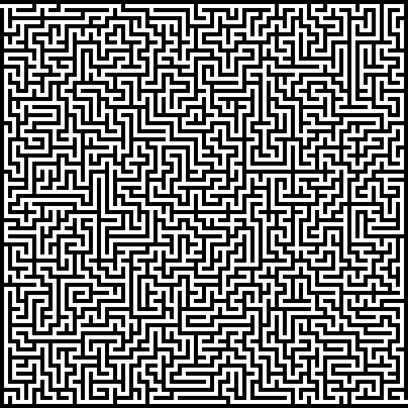
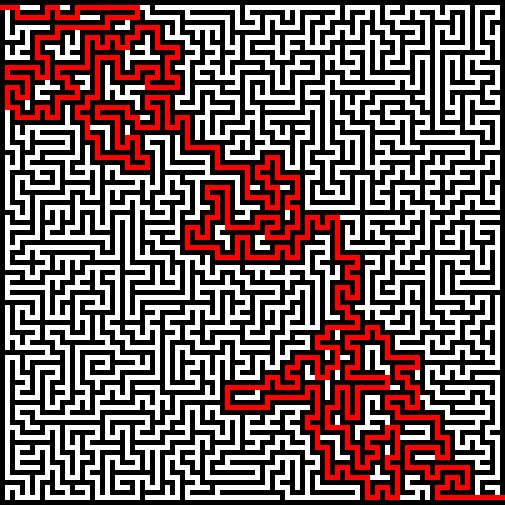

# PHP Maze Solver

Really simple PHP Maze Solver that takes an inputted PNG of a maze and outputs a solved maze as a PNG.

## Usage

```
php solve.php /path/to/maze.png /path/to/output.png
```

Input maze requires that the squares/columns are 5 pixels, walls are black and path is white.

## Example

### Input



### Output

